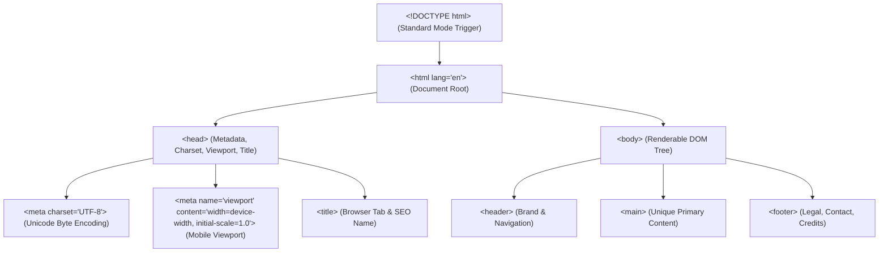
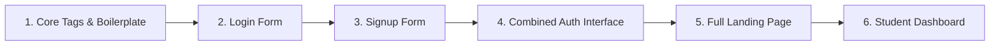

# 🌐 HTML5 Foundations — High Q Solid Academy

<div align="center">

# High Q Solid Academy
### *Web Development Track 02 &bull; HTML5 Foundations*
**"Always Ahead of Others"**

[](https://github.com/High-Q-Solid-Academy/course-html-foundations)
[](https://highqsolidacademy.com)
[](https://highqsolidacademy.com)

</div>

---

## 📖 Theoretical Foundations (Extracted from Academic Web Standards)

### 1. The Anatomy of an HTML5 Document
HyperText Markup Language (HTML) is not a programming language; it is a **structural markup language** that informs user agents (browsers, screen readers, search engine crawlers) how to construct the **Document Object Model (DOM)** tree.



### 2. Element vs. Tag vs. Attribute
- **Tag**: The syntax delimiter, e.g., `<input>` or `</p>`.
- **Element**: The complete component comprising the opening tag, attributes, content, and closing tag:
  $$\text{Element} = \text{Opening Tag} + \text{Attributes} + \text{Node Content} + \text{Closing Tag}$$
- **Attribute**: Modifiers that provide metadata or alter element behavior (e.g., `type="email"`, `required`, `aria-label`).

### 3. Semantic Content Categories (W3C HTML5 Specification)
Modern HTML5 classifies elements into strict structural categories:
1. **Sectioning Content**: Defines explicit scopes in the document outline (`<header>`, `<nav>`, `<main>`, `<section>`, `<article>`, `<aside>`, `<footer>`).
2. **Phrasing / Inline Content**: Text and inline markup (`<span>`, `<strong>`, `<em>`, `<a>`, `<code>`).
3. **Interactive & Form Content**: Elements intended for user input and data transmission (`<form>`, `<input>`, `<select>`, `<textarea>`, `<button>`).

---

## 🚀 The High Q Progressive Spiral Learning Journey

In High Q Solid Academy's curriculum, you will build an authentic software product from the ground up: **The High Q Academy Portal**. Each lesson directly contributes the structural foundation for the next stage.



---

## 📚 Curriculum Breakdown & Wireframes

### Module 1: Core Tags & Boilerplate
- **Concepts**: `<!DOCTYPE html>`, `html`, `head`, `meta`, `title`, heading hierarchy (`h1` through `h6`), semantic paragraphs (`p`), blockquotes, lists (`ul`, `ol`, `li`), and images (`img` with descriptive `alt`).
- **Theory**: Why a page must have exactly **one** `<h1>` tag to establish top-level document hierarchy for accessibility tree parsers.

### Module 2: The Accessible Login Form
- **Concepts**: The `<form>` element, `action`, `method="POST"`, pairing `<label for="id">` explicitly with `<input id="id">`, HTML5 constraint validation (`type="email"`, `type="password"`, `required`, `autocomplete="current-password"`).
- **Wireframe Visual**:
```text
+-------------------------------------------------------------+
|                     LOGIN TO HIGH Q                         |
|                                                             |
|   Email Address:                                            |
|   [ student@highqsolidacademy.com                         ] |
|                                                             |
|   Password:                                                 |
|   [ ******************                                    ] |
|                                                             |
|   [ ] Remember my session              Forgot Password?     |
|                                                             |
|   [                  SIGN IN TO PORTAL                   ]  |
|                                                             |
|   Don't have an account? Create an Account                  |
+-------------------------------------------------------------+
```

### Module 3: The Student Signup Form
- **Concepts**: Handling complex registration forms with `type="tel"`, `pattern`, `<select>` with `<optgroup>`, password confirmation fields, and terms acceptance checkboxes.
- **Wireframe Visual**:
```text
+-------------------------------------------------------------+
|                NEW STUDENT ADMISSION PORTAL                 |
|                                                             |
|   Full Name:                   Phone Number:                |
|   [ Adebule Quam           ]   [ +234 807 208 8794        ] |
|                                                             |
|   Email Address:               Desired Tech Track:          |
|   [ student@highq.edu      ]   [ Web Development (Full) v ] |
|                                                             |
|   Create Password:             Confirm Password:            |
|   [ ******************     ]   [ ******************     ]   |
|                                                             |
|   [X] I agree to High Q Solid Academy Terms of Service      |
|                                                             |
|   [              SUBMIT APPLICATION FOR ADMISSION        ]  |
+-------------------------------------------------------------+
```

### Module 4: The Combined Login / Signup Interface
- **Concepts**: Constructing a dual-panel authentication container prepared for CSS tab toggling and JavaScript state transitions.

### Module 5: The Official High Q Academy Landing Page
- **Concepts**: Full semantic layout combining:
  - `<header>`: Academy logo, motto (*"Always Ahead of Others"*), and `<nav>`.
  - `<section class="hero">`: Headline, CTA buttons (*"Take Path Quiz"*, *"Admission"*).
  - `<section class="stats">`: 98% WAEC/NECO pass rate, 305 highest JAMB score, 1,000+ mentored.
  - `<section class="tracks">`: Semantic `<table>` comparing Web Dev, CBT Training, Digital Skills.
  - `<footer>`: Campus addresses in Ikorodu, Lagos, social links (Telegram, X, TikTok, Facebook).
- **Wireframe Visual**:
```text
+=============================================================+
| [HQ LOGO] HIGH Q SOLID ACADEMY          Home | Courses | Auth |
+=============================================================+
|  HERO SECTION                                               |
|  "Always Ahead of Others" — Excellence in Education         |
|  [ Find Your Path ]               [ Skip to Registration ]  |
+-------------------------------------------------------------+
|  STATISTICS: 98% WAEC Pass | 305 Top JAMB | 1000+ Mentored  |
+-------------------------------------------------------------+
|  PROGRAMS & COURSES:                                        |
|  +-------------------------------------------------------+  |
|  | Track Name          | Duration | Level     | Autograder |  |
|  |---------------------+----------+-----------+------------|  |
|  | Git & GitHub        | 1 Week   | Beginner  | Automated  |  |
|  | HTML5 Foundations   | 2 Weeks  | Beginner  | Automated  |  |
|  | CSS Mastery         | 3 Weeks  | Intermed. | Automated  |  |
|  | JavaScript Core     | 4 Weeks  | Intermed. | Automated  |  |
|  +-------------------------------------------------------+  |
+=============================================================+
|  FOOTER: 8 Pineapple Ave, Ikorodu, Lagos | (c) 2026 High Q  |
+=============================================================+
```

### Module 6: The High Q Student Dashboard
- **Concepts**: Layout semantics for an authenticated application screen:
  - `<aside>`: Vertical navigation bar (Dashboard, My Courses, Grades, Homework, Profile).
  - `<header>`: Welcome banner with student avatar and notifications.
  - `<main>`: Grid of course progress cards, upcoming deadlines, and CBT mock exam links.
- **Wireframe Visual**:
```text
+--------+----------------------------------------------------+
| HIGH Q | WELCOME BACK, STUDENT!                 [Profile v] |
+--------+----------------------------------------------------+
| Nav    | STATS: [ Courses: 4 ] [ Avg: 92% ] [ Status: Good ]|
| - Home |                                                    |
| - Labs | ENROLLED COURSES:                                  |
| - CBT  | +------------------------------------------------+ |
| - Grad | | HTML5 Foundations        [====== 100% ======]  | |
| - Exit | | CSS Mastery              [==== 60%  ........]  | |
|        | | JavaScript Core          [==   25%  ........]  | |
|        | +------------------------------------------------+ |
|        |                                                    |
|        | RECENT LAB SUBMISSIONS & TEST SCORES               |
+--------+----------------------------------------------------+
```

---

## 🛠️ Automated Testing & Grading

Every exercise in the `exercises/` folder is verified by our automated headless DOM test runner:
```bash
# Run tests locally:
npm test
```

When you push your code to GitHub, GitHub Actions executes these checks automatically to ensure your markup is compliant with semantic and accessibility standards.

---

<div align="center">
  <sub>© 2026 High Q Solid Academy Limited &bull; <a href="https://highqsolidacademy.com">highqsolidacademy.com</a> &bull; "Always Ahead of Others"</sub>
</div>
