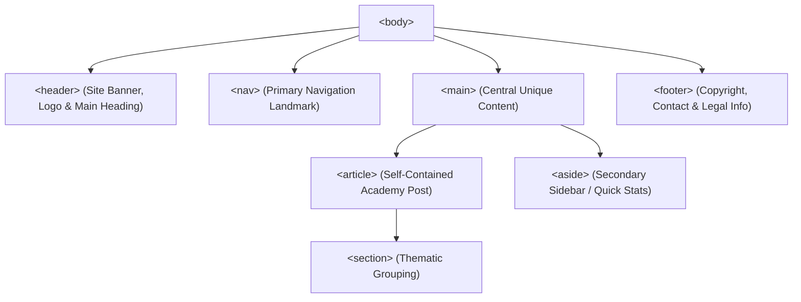

# Exercise 2: Semantic HTML Structure & Landmarks

<div align="center">

### High Q Solid Academy &bull; HTML Foundations Lab 02
**"Always Ahead of Others"**

</div>

---

## 📖 Theoretical Foundations: Semantic Markup vs "Div Soup"

*Reference: HTML Tutorial & Specifications (html.pdf, Chapters 5-8 & HTML5 Semantics)*

### 1. The Semantic Web Philosophy
Before HTML5, web developers were forced to structure layouts using generic `<div>` tags differentiated only by arbitrary class names (e.g. `<div class="header">`, `<div class="nav">`, `<div class="footer">`). This resulted in **"Div Soup"**, creating meaningless DOM trees for assistive technologies and search engine web crawlers.

Semantic HTML uses tags that clearly describe their meaning to both the browser and the developer:
- **Meaningful**: The browser understands the structural role of the content.
- **Accessibility (A11y)**: Screen readers create an accessible outline, allowing visually impaired users to jump directly between landmarks (`<nav>`, `<main>`, `<aside>`).
- **Search Engine Optimization (SEO)**: Search algorithms (Googlebot) prioritize keywords inside `<article>` and `<h1>`-`<h3>` elements over decorative sections.



### 2. Semantic Landmark Element Definitions
1. **`<header>`**: Represents introductory content, typically containing heading elements (`<h1>`-`<h6>`), a logo, or author information.
2. **`<nav>`**: Reserved strictly for major navigation links (`<ul><li><a href="..."></li></ul>`).
3. **`<main>`**: Contains the primary content unique to that document. **Rule**: A document must not have more than one non-hidden `<main>` element.
4. **`<article>`**: Represents a complete, or self-contained, composition in a document (e.g., a blog post, news story, or academy announcement) that is independently distributable.
5. **`<section>`**: Represents a generic standalone section of a document that typically has its own heading.
6. **`<aside>`**: Represents a portion of a document whose content is only tangentially related to the content around it (e.g., sidebars, callouts, related academy links).
7. **`<footer>`**: Contains information about its containing section, such as author bio, copyright notice, or links to related documents.

---

## 📋 Hands-On Lab Instructions

Inside `exercises/exercise-2-semantics/index.html`:
1. Construct the top landmark:
   - A `<header>` containing an `<h1>` with the academy title and a `<nav>` menu.
   - Inside `<nav>`, include an unordered list `<ul>` with at least 3 items (`<li>`) linking to `"Home"`, `"Courses"`, and `"Contact"`.
2. Construct the central landmark:
   - A `<main>` element.
   - Inside `<main>`, include an `<article>` about High Q Solid Academy featuring an `<h2>` heading and at least one `<p>` paragraph.
   - Beside the article, place an `<aside>` element containing quick facts or campus locations (Ikorodu, Lagos).
3. Construct the bottom landmark:
   - A `<footer>` element with copyright information: `&copy; 2026 High Q Solid Academy. All rights reserved.`

---

## 🧪 Verification
Run the automated test suite to verify:
```bash
npm test -- -t "Exercise 2"
```

---

<div align="center">
  <sub>High Q Solid Academy &bull; <a href="https://highqsolidacademy.com">highqsolidacademy.com</a></sub>
</div>
