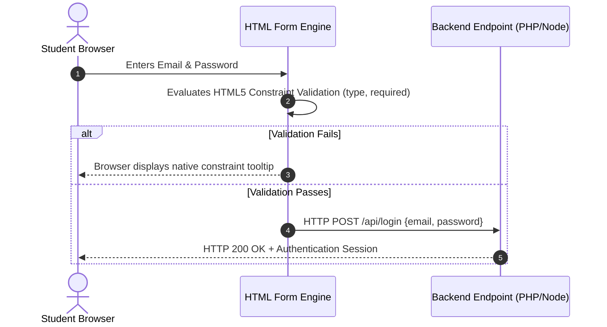

# Exercise 3: Accessible Student Registration & Authentication Forms

<div align="center">

### High Q Solid Academy &bull; HTML Foundations Lab 03
**"Always Ahead of Others"**

</div>

---

## 📖 Theoretical Foundations: Web Forms & Data Submission

*Reference: HTML Tutorial & Specifications (html.pdf, Chapters 14 & 15: Forms & Inputs)*

### 1. The HTTP Form Submission Architecture
HTML forms are the primary mechanism for collecting user input and transmitting it across the network to a web server (like PHP or Node.js).
- **The `<form>` Container**:
  - `action`: Specifies the destination URL where the collected form data will be sent.
  - `method`: Defines the HTTP verb used to transmit data:
    - **`GET`**: Appends name-value pairs directly to the URL query string (`/submit?email=user%40test.com`). **Security Rule**: Never use `GET` for passwords, sensitive student records, or state-mutating operations!
    - **`POST`**: Packages data inside the HTTP request body (`Content-Type: application/x-www-form-urlencoded` or `multipart/form-data`). Data is not visible in browser URLs or server access logs.



### 2. Form Accessibility: Explicit Label-Input Binding
A common mistake in beginner web development is rendering visual text next to an input without programmatic association. 
Screen readers require explicit programmatic binding:
$$\text{Rule: The }\texttt{for}\text{ attribute of the }\texttt{<label>}\text{ MUST match the }\texttt{id}\text{ of the }\texttt{<input>}.$$

```html
<!-- INCORRECT (Inaccessible to assistive technology): -->
Email: <input type="email" name="email">

<!-- CORRECT (High Q Standard): -->
<label for="student-email">Email Address</label>
<input id="student-email" name="email" type="email" required autocomplete="email">
```
Clicking an explicitly associated `<label>` automatically transfers keyboard and cursor focus directly into the corresponding `<input>`, significantly improving mobile user experience.

### 3. Form Controls & HTML5 Input Types
- `type="text"`: Single-line arbitrary text.
- `type="email"`: Enforces RFC 5322 email syntax validation.
- `type="password"`: Masks input characters for privacy.
- `<select>` and `<option>`: Dropdown menu for mutually exclusive selections.
- `<textarea>`: Multi-line text field for student statements or comments.
- `<button type="submit">`: Triggers form validation and dispatch.

---

## 📋 Hands-On Lab Instructions

Inside `exercises/exercise-3-forms/index.html`:
1. Build a `<form>` element configured with `action="#"` and `method="POST"`.
2. Pair a `<label for="fullname">Full Name</label>` with `<input id="fullname" name="fullname" type="text" required>`.
3. Pair a `<label for="email">Email Address</label>` with `<input id="email" name="email" type="email" required>`.
4. Pair a `<label for="course">Select Track</label>` with a `<select id="course" name="course">` containing:
   - `<option value="git">Git & GitHub</option>`
   - `<option value="html">HTML Foundations</option>`
   - `<option value="css">CSS Mastery</option>`
   - `<option value="js">JavaScript Core</option>`
5. Pair a `<label for="comments">Comments</label>` with `<textarea id="comments" name="comments"></textarea>`.
6. Add a submit button: `<button type="submit">Enroll Now</button>`.

---

## 🧪 Verification
Run the automated test suite to verify:
```bash
npm test -- -t "Exercise 3"
```

---

<div align="center">
  <sub>High Q Solid Academy &bull; <a href="https://highqsolidacademy.com">highqsolidacademy.com</a></sub>
</div>
